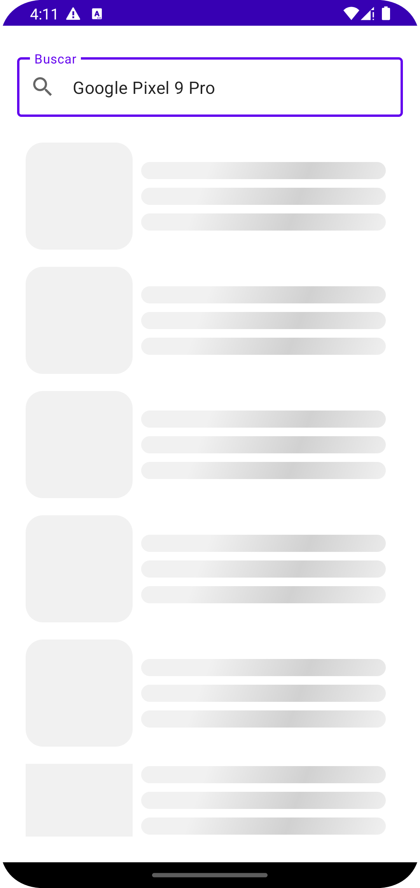
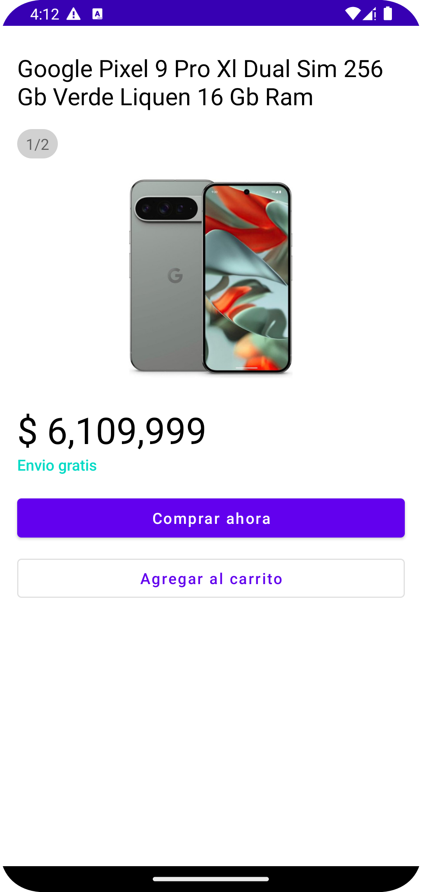

# Meli Android challenge

Android App built with Xml, Data Binding, Coroutines, Flows, LiveData, Material UI Components, Hilt for dependency injection, and Retrofit for networking.

All data provided by [Meli Public Api]([https://developers.mercadolibre.com.ar/es_ar/api-docs-es](https://developers.mercadolibre.com.ar/es_ar/items-y-busquedas)).

## Demo

[Download APK](https://github.com/SEBASIAO/meli-challenge/releases/download/v1.0.0/app-debug.apk) from releases page.

## Results

## Architecture

App architecture follows clean architecture, using the
recommended MVVM pattern. It consists of 3 main layers: presentation, domain and data.

### Data

Here are the implementations responsible for communicating with the server, receiving the information and converting it from an ApiModel into a Business Object (Bo).
Handle any possible exception while network call.

### Domain

Here is the repository contract, which communicates with the data layer,
Any repository implementation belongs to the data layer.

### UI

The presentation layer, composed by UI components, screens, and view models.

- **Main Activity**: It has a text field that triggers the search request as the user clicks on keyboard done button. After requesting and obtaining data, the list of results is presented, which requests another page of information as the user scrolls (pagination).

  If an error ocurred during the request, a toast message is displayed indicating what happended.

  When an item is clicked the viewModel request data to the repository using the ID of the item, then viewModel emits a navigation event that Activity catch and trigger navigation.

- **Details Activity**: It receives the item as an extra in the Intent and then display the result.

  It has a pager to display item's pictures.

### Error Handling

*Exceptions are thrown, Resource.Error are returned.*

When an `Exception` is thrown by the data layer, a repository catch it and convert it to `Resource.Error`,
which is returned to the UI layer using `Either` type. Then, the UI can use this `Error` to change its state or perform some action.

## Testing

### Unit tests

**MainViewModelTest** tests all the viewModel methods, its live data, its flows making sure every UI state is correctly returned with its data, even navigation event.

**SearchRepositoryTest** tests the communication with the remote data source an the data mapping from ApiModels to Business Objects.

**SearchRemoteDataSource** tests the communication with the remote services an the mapping from Retrofit Response object to custom Resource object, also exception and error handling.
